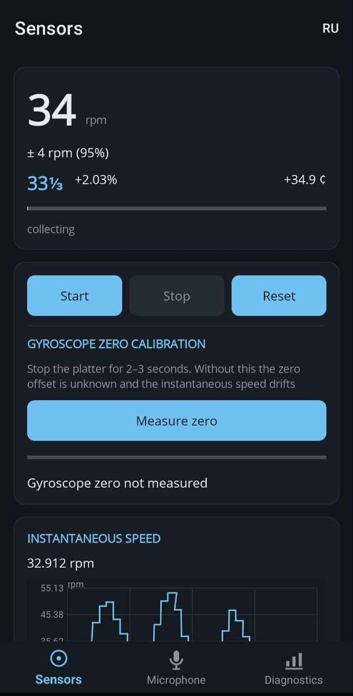
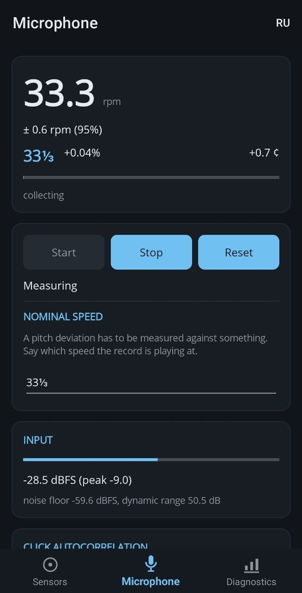
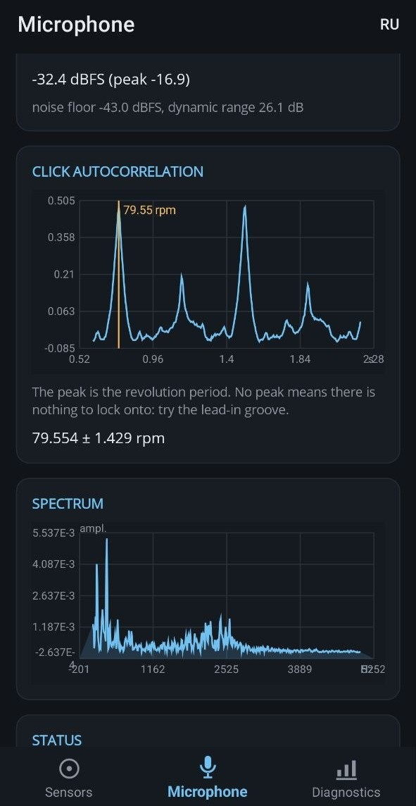
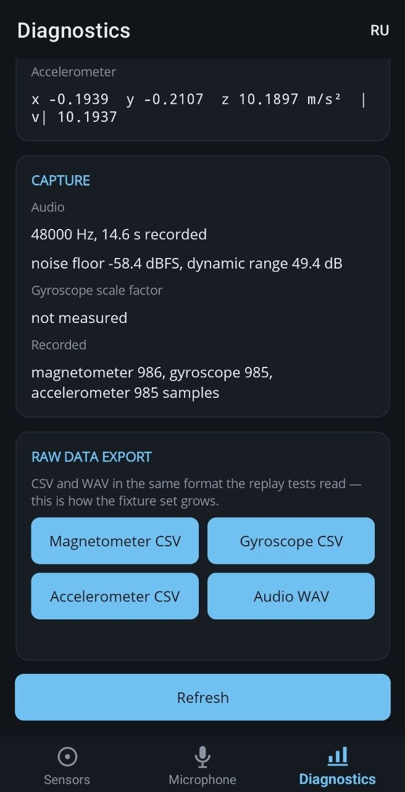

# TurntableSpeed

A .NET MAUI (Android) app that measures how fast a turntable platter is *actually*
turning - two independent ways, with an uncertainty figure attached to every number.

It reports the nominal speed it recognises (33⅓ / 45 / 78 rpm) and the deviation from it
in percent and in cents, in real time.

| Target accuracy | Mode                                   |
|---|----------------------------------------|
| ±0.1 % | sensors - phone lying on the platter   |
| ±0.3 % | acoustic - microphone, through the air |

## How it measures

**Mode A: phone on the platter.** The platter is a rigid body, so angular velocity is the
same everywhere on it; where you put the phone affects balance, not the reading.

- **Magnetometer (reference).** Rotating in the Earth's field, the phone sees the horizontal
  field component trace a circle in its own axes. Hard- and soft-iron distortion are removed by
  fitting an ellipse to that trace; the phase `φ(t) = atan2(m_y − y₀, m_x − x₀)` is unwrapped,
  and angular velocity is the slope of a robust linear regression of `φ(t)`.
- **Gyroscope (secondary).** High rate, good for instantaneous speed, spin-up time and wow &
  flutter - but its absolute value is not trustworthy: MEMS gyroscopes ship with a 1-3 %
  scale-factor error, which is larger than the deviation being measured. Its scale factor is
  calibrated against the magnetometer while the measurement runs.
- **Accelerometer.** Checks the phone is lying flat, and estimates the placement radius from
  centripetal acceleration. Never part of the speed estimate itself.

**Mode B - microphone.** No test record required.

- **Click periodicity (reference).** Dust, scratches and groove wear produce impulsive clicks
  that repeat exactly once per revolution. High-pass above ~5 kHz, take the envelope, subtract a
  running median, autocorrelate over lags of 0.6-2.2 s, and interpolate the peak parabolically
  for sub-sample resolution. Works on the lead-in groove, in pauses and under music.
- **Pitch grid (secondary).** Spectrum folded onto 12 pitch classes, circular mean of the
  phases → deviation from equal temperament at A=440, in cents. Fast, but it mixes the
  turntable's error with the tuning of the recording itself, so the UI labels it as such.
- **Wow spectrum (long run).** Two to three minutes of the cents time series, detrended and
  FFT'd. The expected peak sits at the rotation frequency: 0.5556 Hz for 33⅓, 0.75 Hz for 45.

The idea running through all four primary methods: **frequency and period are measured
reliably, amplitude is not.** Frequency comes from the phone's crystal oscillator (a few ppm),
so it carries no scale error at all.

The two modes do not measure the same thing, and that is the point. A phone weighs 150-250 g,
comparable to a record; on a budget belt drive that load can slow the platter by itself. The app
says so, and shows the disagreement between methods rather than quietly averaging it away.

## Repository layout

```
TurntableSpeed.Core/          DSP, estimators, models, source interfaces.
                              netstandard2.1 + net10.0. References no MAUI, no
                              platform API - it is testable without an emulator.
TurntableSpeed.Core.Tests/    xUnit + CsCheck. Synthetic generators, DSP numerics,
                              property-based tests, golden replays.
TurntableSpeed.App/           MAUI UI, plus the Android capture implementations.
TurntableSpeed.Fixtures/      Recorded material the golden tests replay (WAV, CSV).
docs/math/                    Why the maths is what it is in Russian and English.
TurntableSpeed-Spec.md        The original specification (Russian).
```

## Requirements

- **.NET 10 SDK** (`dotnet --version` should report 10.0.x).
- **MAUI workload:** `dotnet workload install maui-android`
- To build and deploy the app itself: **Android SDK** with `platform-tools` and
  `build-tools`, plus **JDK 17**. Minimum device API level is 24 - `AudioSource.Unprocessed`
  and the audio-effect classes the microphone mode switches off need it.

The core and its tests need none of the Android toolchain.

## Build and run

Clone, then from the repository root:

```bash
# Core library and the full test suite - no Android SDK needed
dotnet test TurntableSpeed.Core.Tests

# The Android app, onto a connected device or a running emulator
dotnet build TurntableSpeed.App -t:Run -f net10.0-android
```

`TurntableSpeed.App` picks its target framework by probing for an Android SDK. If it cannot
find one it builds the Windows head instead and prints a warning: that is a compile check over
the shared view models, XAML and drawing code, **not** a shippable app - Windows and macOS are
explicitly out of scope. Either head can be forced:

```bash
dotnet build TurntableSpeed.App -p:TargetFrameworks=net10.0-android
```

Building the whole solution at once works the same way:

```bash
dotnet build TurntableSpeed.sln
```

### Using the app

Three tabs: **Sensors**, **Microphone**, **Diagnostics**.

<table>
  <tr>
    <td align="center"></td>
    <td align="center"></td>
    <td align="center"></td>
    <td align="center"></td>
  </tr>
  <tr>
    <td align="center"><sub>Sensors</sub></td>
    <td align="center"><sub>Microphone</sub></td>
    <td align="center"><sub>Click autocorrelation</sub></td>
    <td align="center"><sub>Diagnostics</sub></td>
  </tr>
</table>

- *Sensors* - put the phone screen-up on the platter. Let it record 2-3 seconds with the
  platter **stopped** first: that is the gyroscope zero calibration, and the app asks for it.
  Then start the platter and wait; 60 seconds (≈33 revolutions) is where the magnetometer
  reaches its accuracy.
- *Microphone* - put the phone near the record, drop the needle in the lead-in groove and let
  it run. A confident 33-or-45 answer takes 10-15 seconds. If the app warns that the input is
  being processed, the platform's noise suppression is eating the very transients the method
  needs; try another capture source or another device.
- *Diagnostics* - raw sensor values, capture parameters, the computed gyroscope scale factor,
  and CSV/WAV export of the raw stream (useful for filing a bug, and for growing the fixture
  set).

The UI ships in **Russian and English**.

## Documentation

- **[docs/math/](docs/math/)** - the physics and mathematics behind every estimator, derived
  from scratch and cross-referenced to the source files. Available in
  [Russian](docs/math/ru/) and [English](docs/math/en/). No prior acquaintance with musical
  acoustics is assumed; cents, octaves and temperament are built up from nothing in the first
  document.
- **[TurntableSpeed.Fixtures/README.md](TurntableSpeed.Fixtures/README.md)** - what the golden
  fixtures are, and what a good real-world recording needs before it can join them.

## Testing

```bash
dotnet test TurntableSpeed.Core.Tests                       # everything
dotnet test TurntableSpeed.Core.Tests --filter Golden       # one group
```

Four kinds of test carry the weight:

- **Synthetic generators** with parameters known in advance - generate with X, the estimator
  must return X within a tolerance declared in one place (`Tolerances.cs`).
- **Property-based tests** (CsCheck) over ranges of speed, noise and phase, including the
  boundary case: a speed exactly between 33⅓ and 45 must *not* be classified confidently.
- **DSP numerics** - FFT against analytically known spectra, phase unwrapping across ±π,
  parabolic peak interpolation, ellipse fitting, filter responses, circular mean across the
  wrap boundary.
- **Golden replays** of recorded fixtures, checked both against physical truth and against the
  value the estimator gave when the fixture was recorded, so an algorithm change cannot quietly
  move the answer.

Replay is deterministic: `ReplaySampleSource` hands over samples with their original timestamps
but none of the original delays, so a full pipeline runs in milliseconds.

## Out of scope

Deciding that a record was *issued* at a different speed; correcting speed in recorded audio;
cloud, accounts, sync; Windows and macOS support.

## License

MIT - see [LICENSE](LICENSE).
